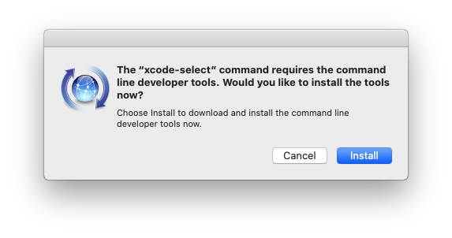
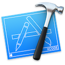

# macOS Development Setup

A macOS development environment setup guide and command-line tool.

![Release][release-install-shield] ![Doc][release-doc-shield] [![License][license-shield]](LICENSE.md)

## Command Line Tools (mandatory)


The Command Line Tools Package is a small self-contained package available for download separately from Xcode and that allows you to do command line development in macOS.

### If you are upgrading

1. Remove old version of the Command Line Tools:

    ```bash
    sudo rm -rf /Library/Developer/CommandLineTools
    ```

### Install Command Line Tools

1. Paste that in the terminal prompt:

    ```bash
    xcode-select --install
    ```

2. A software update popup window will appear. Click `Install`, then agree to the Terms of Service when requested.

    

3. The Command Line Tools is installed at:

    ```bash
    /Library/Developer/CommandLineTools/
    ```

## Xcode (optional)



[Xcode](https://developer.apple.com/xcode/) is Apple's integrated development environment (IDE) for Swift, Objective-C, C, and C++. It also supports Java, AppleScript, Python, Ruby, and ResEdit (Rez).

### Install Xcode

Download and install Xcode from the [App Store](https://apps.apple.com/us/app/xcode/id497799835?mt=12) or from [Apple's website](https://developer.apple.com/xcode/)

:warning: Xcode takes over 13 GB of disk space! Its installation is optional.

## Homebrew (mandatory)


[Homebrew](https://brew.sh) is the missing package manager for macOS.

### Install Homebrew

Open the terminal and run the following script:

```bash
/bin/bash -c "$(curl -fsSL https://raw.githubusercontent.com/Homebrew/install/HEAD/install.sh)"
```

### Or upgrade Homebrew

1. First update the formulae and Homebrew itself:

    ```bash
    brew update
    ```

2. You can find out what is outdated with:

    ```bash
    brew outdated
    ```

3. Upgrade a specific formula with:

    ```bash
    brew upgrade <formula>
    ```

4. Or upgrade everything with:

    ```bash
    brew upgrade
    ```

## Git (mandatory)


[Git](https://git-scm.com) is a free and open source distributed version control system.

### Install and set up git

* Paste that in the terminal prompt:

    ```bash
    bash <(curl -fsSL raw.githubusercontent.com/monsieurborges/mac-setup/master/install) git
    ```

* Or follow the [Git set-up guide](./docs/git-setup.md).

## Terminal

 

Apple switched to using Zsh as the default shell since October 2019. However, you can quickly switch back to Bash if you prefer.

Check out how to select your shell and set up your terminal theme:

* [Bash tutorial](./docs/terminal-bash-setup.md)
* [Zsh tutorial](./docs/terminal-zsh-setup.md)

## Python


[Python](https://www.python.org) is a programming language that lets you work quickly
and integrate systems more effectively.

### Install Pyenv and Python 3.10.7

[Pyenv](https://github.com/pyenv/pyenv) lets you easily switch between multiple versions of Python.

* Paste that in the terminal prompt:

    ```bash
    bash <(curl -fsSL raw.githubusercontent.com/monsieurborges/mac-setup/master/install) python310
    ```

* Or follow the [Python set-up guide](./docs/python-setup.md).

:warning: It is recommended to close and reopen the terminal to apply the configuration!

## Python for Data Science


### Python Packages

* TensorFlow, Keras, numpy, pandas
* scipy, scikit-learn, scikit-image, sk-video
* Matplotlib, pillow
* Jupyter lab & extensions

### Install Python Data Science packages

* Paste that in the terminal prompt:

    ```bash
    bash <(curl -fsSL raw.githubusercontent.com/monsieurborges/mac-setup/master/install) pypackages
    ```

* Or follow the [Python Data Science set-up guide](./docs/python-data-science-setup.md).

## Visual Studio Code - VS Code


[Visual Studio Code](https://code.visualstudio.com/) is a lightweight but powerful source code editor.

Check out the [VS Code set-up guide](./docs/vs-code.md).

### Using VS Code with particular technologies

Microsoft created a collection of recipes for using VS Code with particular technologies (mostly Web).

Make sure to visit it at [Microsoft/vscode-recipes](https://github.com/Microsoft/vscode-recipes).


## LaTeX - MacTeX (optional)


[MacTeX](https://tug.org/mactex/mactex-download.html) is an install package which installs everything needed to run TeX on Mac OS X.

### Uninstall old version

It is easy to remove most software installed by MacTeX:

```bash
# Remove MacTeX 202X
sudo rm -rf /usr/local/texlive/202X
```

### Install LaTeX

1. Install Ghostscript

    ```bash
    brew install ghostscript
    ```

2. Download MacTeX from <https://tug.org/mactex/mactex-download.html>

3. Double click on the downloaded file to install
4. Several pages of information will be displayed
5. One of the last is shown below. Click on the `Customise` button

    

6. Deselect the packages `Ghostscript 9.50`, `Ghostscript Dynamic Library` and `GUI Applications`, then click on `Install`

    

## Qt


[Qt](https://www.qt.io) is a cross-platform application development framework for desktop, embedded and mobile using C++ or Python. Supported Platforms include Linux, OS X, Windows, VxWorks, QNX, Android, iOS, BlackBerry, Sailfish OS and others.


### Install Qt

1. Download and run the [Qt online Installer](https://www.qt.io/download-qt-installer)
2. Click `Next` on the Welcome to the Qt Online installer window
3. Click `Skip` on the Qt Account window
4. Accept the Qt Open Source Usage Obligations, and click `Continue`
5. Click `Continue` no the Setup - Qt window
6. The installer will complain that Xcode is not installed, just click `OK`
7. On the Qt Creator User Experience Development window, make your choice and click `Continue`
8. Click `Continue` on the Installation Folder window
9. Select the latest Qt version prebuilt components:
   * [x] `Qt 6.1.0` / `macOS`
   * [x] `Developer and Designer Tools` / `Qt Installer Framework 3.2`
10. Then click `Next` and `Install`

### Add Qt Creator into Applications

Paste that in the terminal prompt:

```bash
# Symbolic link
ln -s "${HOME}/Qt/Qt Creator.app" "/Applications"
```

## FFmpeg


[FFmpeg](https://ffmpeg.org/documentation.html) is a complete, cross-platform solution to record, convert and stream audio and video.

### Install FFmpeg

Run that in the terminal:

```bash
# Leave Python virtual environment
deactivate

# Install FFmpeg with all modules
brew install ffmpeg
```

## OpenCV


[OpenCV](https://opencv.org) (Open Source Computer Vision Library) is an open source computer vision and machine learning software library.

### UPGRADE OpenCV

1. Uninstall old version:

    ```bash
    CV_DIRS=(
        "/usr/local/share"
        "/usr/local/include"
        "/usr/local/lib"
        "/usr/local/bin"
    )

    sudo -v

    for cv_dir in ${CV_DIRS[@]}; do
        sudo find ${cv_dir} -name "*opencv*" -exec rm -rf {} \;
    done
    ```

2. Remove installation directories:

    ```bash
    rm -rf "${HOME}/opencv"
    rm -rf "${HOME}/opencv_contrib"
    ```

3. Install OpenCV following the instructions below!

### Install OpenCV with Python and Qt support

1. Choose the version. Paste that in the terminal prompt:

    ```bash
    # export OPENCV_VERSION="4.X.X"
    # export OPENCV_VERSION="3.4.X"
    export OPENCV_VERSION="4.6.0"
    ```

2. Easy install using mac-setup:

    ```bash
    bash <(curl -fsSL raw.githubusercontent.com/monsieurborges/mac-setup/master/install) opencv
    ```

3. Or check out the [OpenCV set-up guide](./docs/opencv-setup.md) with Qt support.

## Contributing

All contributions are welcome! There are many ways in which you can participate in the project, for example:

* [Submit bugs and feature requests](https://github.com/monsieurborges/mac-setup/issues)
* Review the documentation and make pull requests for anything from typos to new content

If you are interested in fixing issues and contributing directly to the code base, please read our [Contribution Guide](CONTRIBUTING.md).

## Feedback

* [Request a new feature](CONTRIBUTING.md)
* [File an issue](https://github.com/monsieurborges/mac-setup/issues)

## Author

* [Monsieur Borges](https://github.com/monsieurborges)

## License

The source code is licensed under the [MIT license](LICENSE.md).

The content of this project itself is licensed under the [Creative Commons Attribution 4.0 International](https://creativecommons.org/licenses/by/4.0).

[release-doc-shield]: https://img.shields.io/badge/Doc-29--Oct--2024-blue
[release-install-shield]: https://img.shields.io/badge/dynamic/json?color=blue&label=Release&prefix=install-&query=$.release&url=https://raw.githubusercontent.com/monsieurborges/mac-setup/master/package.json
[license-shield]: https://img.shields.io/github/license/monsieurborges/mac-setup
